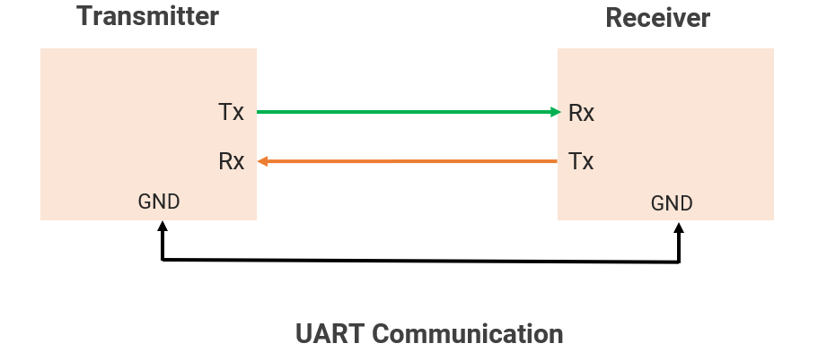
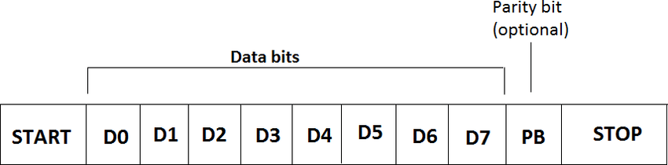

# UART — Universal Asynchronous Receiver/Transmitter

UART is a simple, widely-used serial communication protocol for exchanging data between two devices, one bit at a time, over just two wires — no shared clock signal required.

## The Physical Wires

A minimal UART connection uses two signal wires (plus a shared ground):

| Wire | Direction | Purpose |
|------|-----------|---------|
| **TX** (Transmit) | Output from sender | Carries outgoing serial data |
| **RX** (Receive)  | Input to receiver  | Carries incoming serial data |

Two UART devices are cross-connected: Device A's TX goes to Device B's RX, and vice versa — enabling full-duplex (simultaneous two-way) communication.

## Frame Structure

Data isn't sent as a continuous stream — it's broken into **frames**, each carrying one byte (typically). A frame looks like this:

| Field | Typical Size | Description |
|-------|-------------|--------------|
| **Idle** | — | The line sits high when nothing is being sent |
| **Start bit** | 1 bit, always `0` | Signals the beginning of a new frame; this falling edge is what lets the receiver sync up |
| **Data bits** | 5–9 bits (commonly 8) | The actual payload, sent least-significant-bit (LSB) first |
| **Parity bit** | 0 or 1 bit (optional) | Basic error-checking (even/odd parity) |
| **Stop bit(s)** | 1 or 2 bits, always `1` | Marks the end of the frame; returns the line to idle |

A common configuration is written as **"8N1"** — 8 data bits, No parity, 1 stop bit — the most widely used UART format.

# Modules and Interfaces
## uart_if — UART Handshake Interface
A parameterized SystemVerilog `interface` that bundles the four signals shared between a UART transmitter and receiver, with two `modport`s (`tx` and `rx`) that give each side a mirrored view of the same wires.

### Why It Exists

- Cuts down on port-list clutter and copy-paste errors
- Keeps `DATA_WIDTH` consistent everywhere the interface is used (set once, via the parameter)
- Encodes signal direction *per role* (`tx` vs `rx`) rather than per physical wire, so the same interface can't accidentally be wired backwards between modules

### Modport Directions

The same four signals point in **opposite directions** depending on which modport is used — that's the entire purpose of having two modports instead of one:

| Signal  | `tx` modport | `rx` modport |
|---------|:------------:|:------------:|
| `sig`   | `output`     | `input`      |
| `data`  | `input`      | `output`     |
| `valid` | `input`      | `output`     |
| `ready` | `output`     | `input`      |

Intuition for each signal:
- **`sig`** — `tx` drives the serial line out; `rx` reads the serial line in.
- **`data`** — `tx` reads data it needs to send; `rx` writes data it has decoded.
- **`valid`** — `tx` reads "is my input data good to send?"; `rx` writes "is my decoded output good to read?"
- **`ready`** — `tx` writes "I can accept new data now"; `rx` reads "can the outside world accept my decoded data now?"

## uart_tx — UART Transmitter
A parameterized SystemVerilog module that serializes parallel data into a standard UART frame (1 start bit, `DATA_WIDTH` data bits LSB-first, 1 stop bit) and drives it out over a `uart_if` interface.
